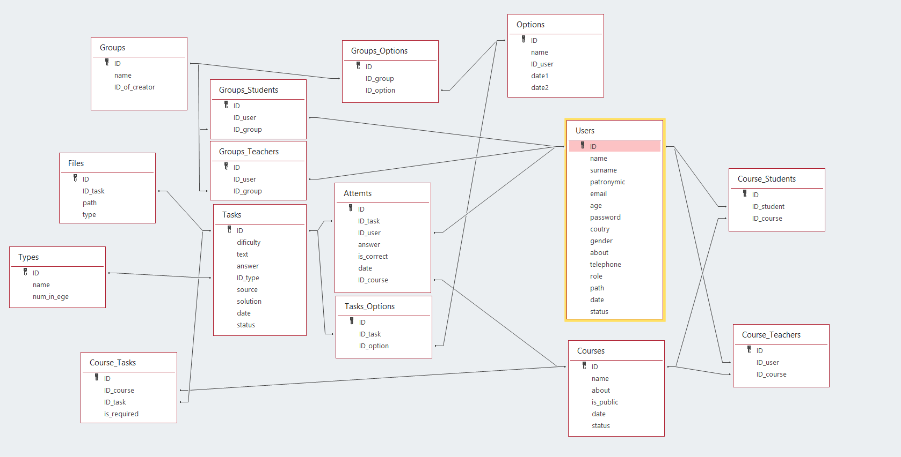

    Предпрофессиальная олимпиада школьников
    Продуктовый сектор Информационный технологии
    Командный кейс 6: Образовательный портал


> Андреев Глеб \
> Еронин Максим \
> Никитин Тимофей \
> Кравцов Николай \
> Степанова Елена 

<b>Государственное бюджетное общеобразовательное учреждение города Москвы «Лицей «Вторая школа» имени В.Ф. Овчинникова»</b>

Сайт написан на `python` с использованием фреймворка `Flask`.

# Описание проекта

Проект "Сдай ЕГЭ" предназначен для помощи учащимся в подготовке к ЕГЭ и учителям, которые хотят использовать данный сайт для помощи учащимся в этом. Сайт предоставляет различные задания, которые можно фильтровать по сложности, типу и источнику. На данном сайте предусмотрены группы для работы с преподавателями, курсы с необходимой для подготовки теорией и варианты для тестирования собственных сил, подготовленные редакцией нашего сайта.

# Установка

1. Клонируйте репозиторий:
    ```sh
    git clone https://github.com/AnderPlay1/sdai_ege_rep.git
    ```

2. Перейдите в директорию проекта:
    ```sh
    cd sdai_ege_rep
    ```

3. Создайте виртуальное окружение:
    ```sh
    python -m venv venv
    ```

4. Активируйте виртуальное окружение:
    - Windows:
        ```sh
        venv\Scripts\activate
        ```
    - macOS/Linux:
        ```sh
        source venv/bin/activate
        ```

5. Установите зависимости:
    ```sh
    pip install -r requirements.txt
    ```

# Запуск

1. Запустите приложение:
    ```sh
    python main.py
    ```

2. Откройте браузер и перейдите по адресу:
    ```
    http://127.0.0.1:8080/
    ```

# Структура проекта

- [`main.py`](/main.py) - основной файл приложения Flask.
- [templates](/templates) - директория с HTML-шаблонами.
- [static](/static) - директория с файлами статики (CSS, JS, изображения).
- [Samples_For_Courses](/Samples_For_Courses/) - материалы курсов, предоставляемых на сайте
- [requirements.txt](/README.md) - список зависимостей проекта.

# Использование

## Фильтрация заданий

На главной странице сайта вы можете фильтровать задания по следующим критериям:
- **Сложность**: выберите одну или несколько сложностей.
- **Тип задания**: выберите тип задания из выпадающего списка.
- **Источник**: выберите один или несколько источников.

## Отправка ответов

Для каждого задания вы можете ввести свой ответ и сравнить его с правильным ответом, нажав на кнопку "Показать правильный ответ".

## Варианты

На сайте существуют уже готовые варианты по мотивам ЕГЭ, которые можно решать в целях подготовки с временным ограничением экзамена. Также существует возможность создавать подборки в целях отработки того или иного материала.

Если учитель не нашел существующего варианта на сайте, он может составить вариант из уже существующих задач или загрузить свои задачи.

## Форум
На сайте существует форум, который может быть полезен для пользователей с целью выяснить определенные моменты у более опытных участников, учителей или администрации сайта.

# Описание работы сайта 
## Схема базы данных

##  `db_functions.py`

Файл `db_functions.py` содержит функции для взаимодействия с базой данных. Эти функции используются для выполнения различных операций с данными, таких как получение, добавление, обновление и удаление записей.

### Основные функции

- `get_user_id(email, role)`: Возвращает идентификатор пользователя по его электронной почте и роли.
    - **Параметры**:
        - `email` (str): Электронная почта пользователя.
        - `role` (int): Роль пользователя (например, 1 для ученика, 2 для учителя).
    - **Возвращает**: Идентификатор пользователя (int).

- `get_user(uid, role)`: Возвращает информацию о пользователе по его идентификатору и роли.
    - **Параметры**:
        - `uid` (int): Идентификатор пользователя.
        - `role` (int): Роль пользователя.
    - **Возвращает**: Словарь с информацией о пользователе.

- `get_all_tasks(role)`: Возвращает все задания для указанной роли.
    - **Параметры**:
        - `role` (int): Роль пользователя.
    - **Возвращает**: Список заданий.

- `add_task(task)`: Добавляет новое задание в базу данных.
    - **Параметры**:
        - `task` (dict): Словарь с информацией о задании.
    - **Возвращает**: Идентификатор добавленного задания (int).

- `update_task(task_id, task)`: Обновляет информацию о задании в базе данных.
    - **Параметры**:
        - `task_id` (int): Идентификатор задания.
        - `task` (dict): Словарь с обновленной информацией о задании.
    - **Возвращает**: Ничего.

- `delete_task(task_id)`: Удаляет задание из базы данных.
    - **Параметры**:
        - `task_id` (int): Идентификатор задания.
    - **Возвращает**: Ничего.

### Пример использования

```python
import db_functions as db

# Получение идентификатора пользователя
user_id = db.get_user_id('example@example.com', 1)

# Получение информации о пользователе
user_info = db.get_user(user_id, 1)

# Получение всех заданий для ученика
tasks = db.get_all_tasks(1)

# Добавление нового задания
new_task = {
    'text': 'Пример задания',
    'difficulty': 3,
    'number': 1,
    'source': 'Учебник',
    'answer': '42'
}
task_id = db.add_task(new_task)

# Обновление задания
updated_task = {
    'text': 'Обновленный текст задания',
    'difficulty': 4,
    'number': 1,
    'source': 'Учебник',
    'answer': '43'
}
db.update_task(task_id, updated_task)

# Удаление задания
db.delete_task(task_id)
```
# Лицензия

Этот проект лицензирован под лицензией MIT. Подробности см. в файле `LICENSE`.